# 자료구조
자료구조(data structure)는 효율적으로 데이터를 관리하고 수정, 삭제, 탐색, 저장할 수 있는 데이터 집합을 말합니다.

---
## 복잡도

#### 시간 복잡도
- 빅오 표기법
	- 시간 복잡도란 '문제를 해결하는데 걸리는 시간과 입력의 함수 관계'를 가리킵니다. 어떠한 알고리즘의 로직이 '얼마나 오랜 시간'이 걸리는지를 나타내는데 쓰이며, 보통 빅오표기법으로 나타냅니다.
	- 빅오표기법이란 입력 범위 n을 기준으로 해서 로직이 몇 번 반복되는지 나타내는 것입니다.
	- '가장 영향을 많이 끼치는' 항의 상수 인자를 빼고 나머지 항을 없앱니다.
- 시간 복잡도의 존재 이유
	- 시간복잡도는 효율적인 코드로 개선하는데 쓰이는 척도가 됩니다.
	- 예를들어 O(n^2)의 시간 복잡도를 가지고 9초가 걸린다고 한다면, 이를 O(n)의 시간 복잡도를 가지는 알고리즘으로 개선한다면 3초가 걸리게 됩니다.
- 시간 복잡도의 속도 비교
	- O(n^2) > O(n) > O(1) 순으로 시간 복잡도가 커지므로 시간복잡도가 적은 방법을 지향해야합니다.

#### 공간 복잡도
- 공간복잡도는 프로그램을 실행시켰을때 필요로 하는 자원 공간의 양을 말합니다.
- 정적 변수로 선언된 것 말고도 동적으로 재귀적인 함수로 인해 공간을 계속해서 필요로 할 경우도 포함됩니다.

#### 자료 구조에서의 시간 복잡도
- 다음은 자주 쓰는 자료구조의 시간복잡도를 나타낸 모습입니다. 보통 시간 복잡도를 생각할 때 평균, 그리고 최악의 시간 복잡도를 고려하면서 씁니다.

###### 자료구조의 평균 시간복잡도

| 자료구조                        | 접근      | 탐색      | 삽입      | 삭제      |
| --------------------------- | ------- | ------- | ------- | ------- |
| 배열(array)                   | O(1)    | O(n)    | O(n)    | O(n)    |
| 스택(stack)                   | O(n)    | O(n)    | O(1)    | O(1)    |
| 큐(queue)                    | O(n)    | O(n)    | O(1)    | O(1)    |
| 이중연결리스트(doubly linked list) | O(n)    | O(n)    | O(1)    | O(1)    |
| 해시테이블(hash table)           | O(n)    | O(n)    | O(1)    | O(1)    |
| 이진탐색트리(BST)                 | O(logn) | O(logn) | O(logn) | O(logn) |
| ABL트리                       | O(logn) | O(logn) | O(logn) | O(logn) |
| 레드블랙트리                      | O(logn) | O(logn) | O(logn) | O(logn) |

###### 자료구조 최악의 시간복잡도

| 자료구조                        | 접근      | 탐색      | 삽입      | 삭제      |
| --------------------------- | ------- | ------- | ------- | ------- |
| 배열(array)                   | O(1)    | O(n)    | O(n)    | O(n)    |
| 스택(stack)                   | O(n)    | O(n)    | O(1)    | O(1)    |
| 큐(queue)                    | O(n)    | O(n)    | O(1)    | O(1)    |
| 이중연결리스트(doubly linked list) | O(n)    | O(n)    | O(1)    | O(1)    |
| 해시테이블(hash table)           | O(n)    | O(n)    | O(n)    | O(n)    |
| 이진탐색트리(BST)                 | O(n)    | O(n)    | O(n)    | O(n)    |
| ABL트리                       | O(logn) | O(logn) | O(logn) | O(logn) |
| 레드블랙트리                      | O(logn) | O(logn) | O(logn) | O(logn) |

---
## 선형 자료 구조
선형 자료 구조란 요소가 일렬로 나열되어 있는 자료 구조를 말합니다.

#### 연결 리스트
연결리스트는 데이터를 감싼 노드를 포인터로 연결해서 공간적인 효율성을 극대화시킨 자료구조입니다. 삽입과 삭제가 O(1)이 걸리며 탐색에는 O(n)이 걸립니다.
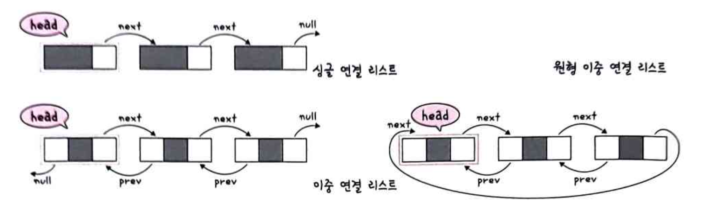
- 싱글 연결 리스트: next 포인터만 가집니다.
- 이중 연결 리스트: next 포인터와 prev 포인터를 가집니다.
- 원형 이중 연결 리스트: 이중 연결 리스트와 같지만 마지막 노드의 next 포인터가 헤드 노드를 가리키는것을 말합니다.

#### 배열
배열(array)은 같은 타입의 변수들로 이루어져 있고, 크기가 정해져 있으며, 인접한 메모리 위치에 있는 데이터를 모아놓은 집합입니다. 또한, 중복을 허용하고 순서가 있습니다.
탐색에 O(1)이 되어 랜덤 접근이 가능합니다. 삽입과 삭제에는 O(n)이 걸립니다. 따라서 데이터 추가와 삭제를 많이 하는 것은 연결 리스트, 탐색을 많이 하는 것은 배열로 하는 것이 좋습니다.
배열은 인덱스에 해당하는 원소를 빠르게 접근해야 하거나 데이터를 쌓고 싶을 때 사용합니다.

###### 랜덤 접근과 순차적 접근
직접 접근이라고 하는 랜덤 접근은 동일한 시간에 배열과 같은 순차적인 데이터가 있을때 임의의 인덱스에 해당하는 데이터에 접근할 수 있는 기능입니다. 이는 데이터를 저장된 순서대로 검색해야 하는 순차적 접근과는 반대입니다.

###### 배열과 연결 리스트 비교
배열은 상자를 순서대로 나열한 데이터 구조이며 몇 번째 상자인지만 알면 해당 상자의 요소를 끄집어낼 수 있습니다.
연결 리스트는 상자를 선으로 연결한 형태의 데이터 구조이며, 상자 안의 요소를 알기 위해서는 하나씩 상자 내부를 확인해봐야 한다는 점이 다릅니다.
탐색은 배열이 빠르고 연결리스트는 느립니다. 배열의 경우 상자 위에 있는 요소를 탐색하면 되는 반면에, 연결리스트는 상자를 열고 주어진 선을 기반으로 순차적으로 탐색해야합니다.
하지만 데이터 추가 및 삭제는 연결리스트가 더 빠르고 배열은 느립니다. 배열은 모든 상자를 앞으로 옮겨야 추가가 가능하지만, 연결리스트는 선을 바꿔서 연결해주기만 하면 되기 때문입니다.

#### 벡터
벡터는 동적으로 요소를 할당할 수 있는 동적 배열입니다. 컴파일 시점에 개수를 모른다면 벡터를 써야 합니다. 또한, 중복을 허용하고 순서가 있고 랜덤 접근이 가능합니다. 탐색과 맨 뒤의 요소를 삭제하거나 삽입하는데 O(1)이 걸리며, 맨 뒤나 맨 앞이 아닌 요소를 삭제하고 삽입하는데 O(n)의 시간이 걸립니다.

- Java의 ArrayList가 Vector로 구현되어있다. 
- 핵심 특징
	- 배열 기반
	- 메모리 연속
	- 인덱스 접근 O(1)
	- capacity 부족 시 배열 재할당
#### 스택
스택은 가장 마지막으로 들어간 데이터가 가장 첫번째로 나오는 성질(LIFO, Last In First Out)을 가진 자료구조입니다. 
재귀적인 함수, 알고리즘에 사용되며 웹 브라우저 방문 기록 등에 쓰입니다. 삽입 및 삭제에 O(1), 탐색에 O(n)이 걸립니다.

#### 큐
큐(Queue)는 먼저 집어넣은 데이터가 먼저 나오는 성질 (FIFO, First In First Out)을 지닌 자료구조이며, 나중에 집어넣은 데이터가 먼저 나오는 스택과는 반대되는 개념을 가졌습니다. 삽입 및 삭제에 O(1), 탐색에 O(n)이 걸립니다.
CPU 작업을 기다리는 프로세스, 스레드 행렬 또는 네트워크 접속을 기다리는 행렬, 너비 우선 탐색, 캐시 등에 사용됩니다.
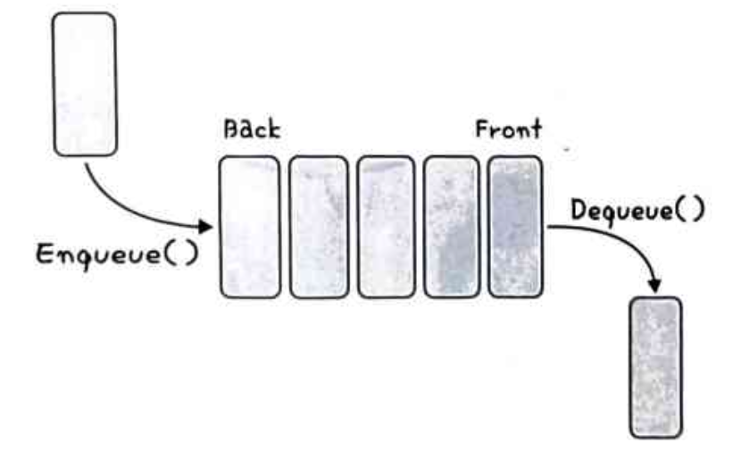

---

## 비선형 자료 구조
비선형 자료 구조란 일렬로 나열하지 않고 자료 순서나 관계가 복잡한 구조를 말합니다.
일반적으로 트리나 그래프를 말합니다.

#### 그래프
그래프는 정점과 간선으로 이루어진 자료 구조를 말합니다.
###### 정점과 간선
어떠한 곳에서 어떠한 곳으로 무언가를 통해 간다고 했을때 '어떠한 곳'은 정점(vettex)이 되고 '무언가'는 간선(edge)이 됩니다.
정점으로 나가는 간선을 해당 정점의 outdegree라고 하며, 들어오는 간선을 해당 정점의 indegree라고 합니다. 또한, 정점은 약자로 V 또는 U 라고 하며, 보통 어떤 정점으로부터 시작해서 어떤 정점까지 간다를 "U에서부터 V로 간다."라고 표현합니다. 
정점과 간선으로 이루어진 집합을 '그래프(Graph)'라고 합니다.
###### 가중치
가중치는 간선과 정점 사이에 드는 비용을 뜻합니다. 1번 노드와 2번 노드까지 가는 비용이 한 칸이라면 1번 노드에서 2번 노드까지의 가중치는 한 칸입니다. 예를들어 제가 성남이라는 정점에서 네이버라는 정점까지 가는데 걸리는 택시비가 13,000원이라면 성남에서 네이버까지 가는 가중치는 13,000원이 됩니다.

#### 트리
트리는 그래프 중 하나로 그래프의 특징처럼 정점과 간선으로 이루어져 있고, 트리 구조로 배열된 일종의 계층적 데이터의 집합입니다. 루트 노드, 내부 노드, 리프 노드 등으로 구성됩니다. 참고로 트리로 이루어진 집합을 숲이라고 합니다.

##### 트리의 특징
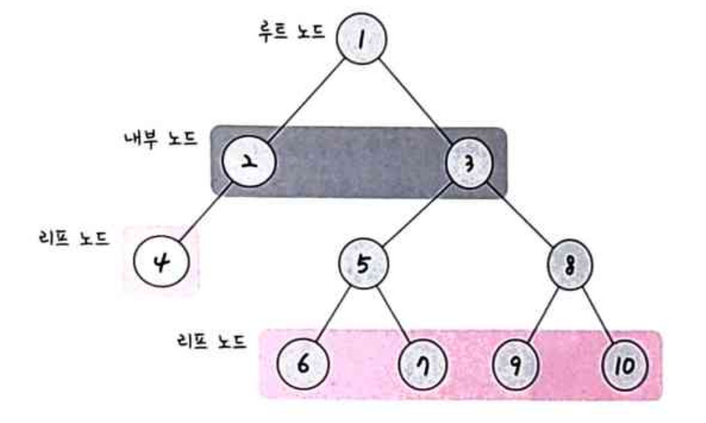
1. 부모, 자식 계층구조를 가집니다. 지금 보면 5번 노드는 6번 노드와 7번 노드의 부모 노드이고, 6번 노드와 7번 노드는 5번 노드의 자식 노드입니다. 같은 경로상에서 어떤 노드보다 위에 있으면 부모, 아래에 있으면 자식 노드가 됩니다.
2. V - 1 = E라는 특징이 있습니다. 간선 수는 노드 수 - 1 입니다.
3. 임의의 두 노드 사이의 경로는 '유일무이'하게 '존재'합니다. 즉, 트리 내의 어떤 노드와 어떤 노드까지의 경로는 반드시 있습니다.

##### 트리의 구성
트리는 루트노드, 내부노드, 리프노드로 이루어져 있습니다.
##### 루트 노드
가장 위에 있는 노드를 뜻합니다. 보통 트리 문제가 나오고 트리를 탐색할 때 루트 노드를 중심으로 탐색하면 문제가 쉽게 풀리는 경우가 많습니다.
##### 내부 노드
루트 노드와 내부 노드 사이에 있는 노드를 뜻합니다.
##### 리프 노드
실제 알고리즘 고인물과 카톡한 내용입니다. 다음 그림처럼 리프 노드는 자식 노드가 없는 노드를 뜻합니다.
###### 트리의 높이와 레벨
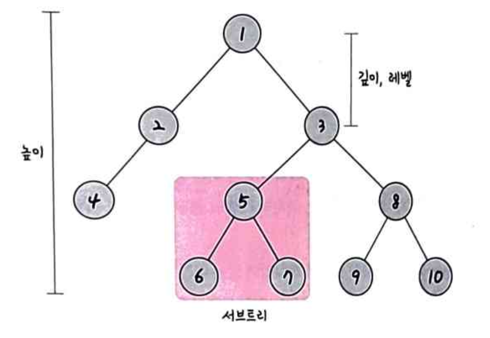
- 깊이: 트리에서의 깊이는 각 노드마다 다르며, 루트 노드부터 특정 노드까지 최단 거리로 갔을 때의 거리를 말합니다. 예를 들어 4번 노드의 깊이는 2입니다.
- 높이: 트리의 높이는 루트 노드부터 리프 노드까지 거리 중 가장 긴 거리를 의미하며, 앞 그림의 트리 높이는 3입니다.
- 레벨: 트리의 레벨은 주어지는 문제마다 조금씩 다르지만 보통 깊이와 같은 의미를 지닙니다. 1번 노드를 0레벨이라고 하고 2번 노드, 3번 노드까지의 레벨을 1레벨이라고 할 수도 있고, 1번 노드를 1레벨이라고 한다면 2번 노드와 3번 노드는 2레벨이 됩니다.
- 서브트리: 트리 내의 하위 집합을 서브트리라고 합니다. 트리 내에 있는 부분집합이라고도 보면 됩니다.
  지금 보면 5번, 6번, 7번 노드가 이 트리의 하위 집합으로 "저 노드들은 서브트리이다."라고 합니다.

##### 이진 트리
이진 트리는 자식의 노드 수가 두개 이하인 트리를 의미하며, 이를 다음과 같이 분류합니다.

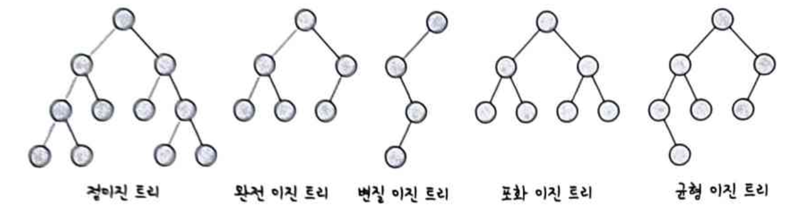
- 정이진 트리: 자식 노드가 0 또는 두 개인 이진 트리를 의미합니다.
- 완전 이진 트리: 왼쪽에서부터 채워져 있는 이진 트리를 의미합니다. 마지막 레벨을 제외하고는 모든 레벨이 완전히 채워져 있으며, 마지막 레벨의 경우 왼쪽부터 채워져 있습니다.
- 변질 이진 트리: 자식 노드가 하나밖에 없는 이진 트리를 의미합니다.
- 포화 이진 트리: 모든 노드가 꽉 차 있는 이진 트리를 의미합니다.
- 균형 이진 트리: 왼쪽과 오른쪽 노드의 높이 차이가 1 이하인 이진 트리를 의미합니다. map, set을 구성하는 레드 블랙 트리는 균형 이진 트리 중 하나입니다.

##### 이진 탐색 트리
이진 탐색 트리(BST)는 노드의 오른쪽 하위 트리에는 '노드 값보다 큰 값'이 있는 노드만 포함되고, 왼쪽 하위 트리에는 '노드 값보다 작은 값'이 들어 있는 트리를 말합니다.
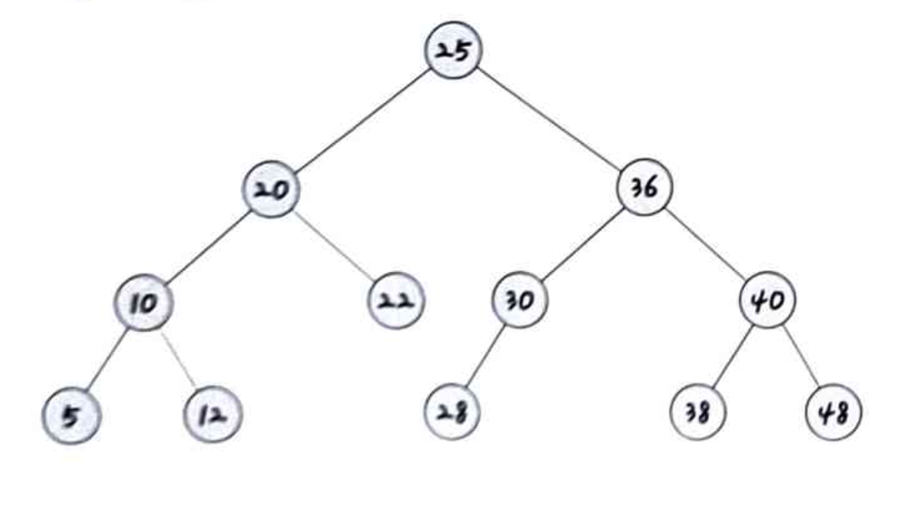
이렇게 두면 검색을 하기에 용이합니다. 왼쪽에는 작은 값, 오른쪽에는 큰 값이 이미 정해져 있기 때문에 10을 찾으려고 한다면 25의 왼쪽 노드들만 찾으면 됩니다. 보통 요소를 찾을 때 이진탐색트리의 경우 O(logn)이 걸립니다. 하지만 최악의 경우 O(n)이 걸립니다.

그 이유는 이진 탐색 트리는 삽입 순서에 따라 선형적일 수 있기 때문입니다.
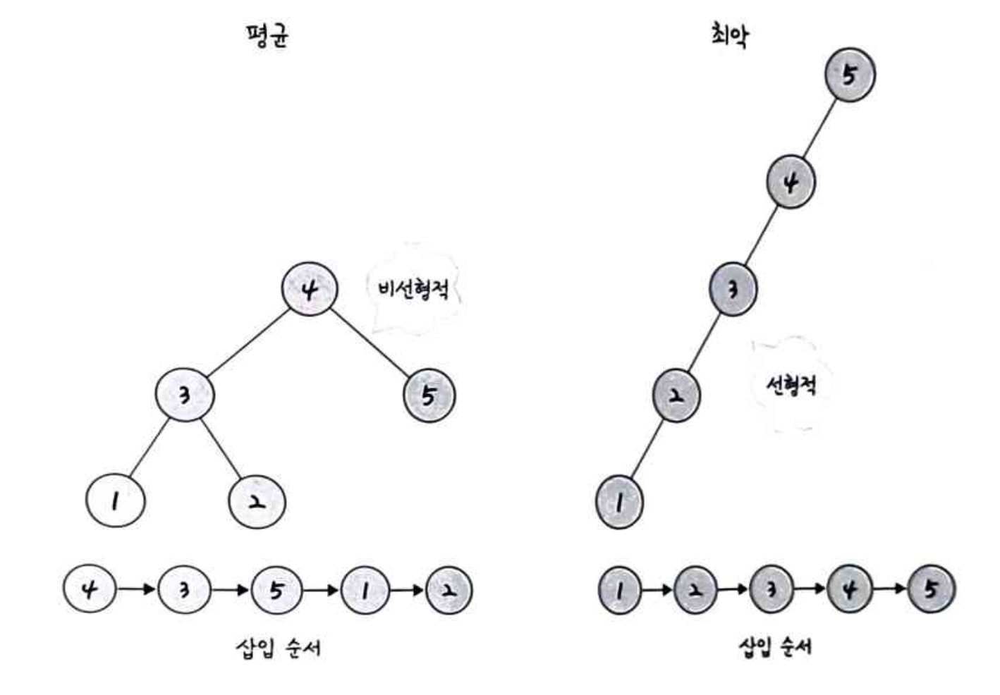

##### AVL 트리
AVL 트리는 앞서 설명한 최악의 경우 선형적인 트리가 되는 것을 방지하고 스스로 균형을 잡는 이진 탐색 트리입니다. 두 자식 서브트리의 높이는 항상 최대 1만큼 차이난다는 특징이 있습니다.

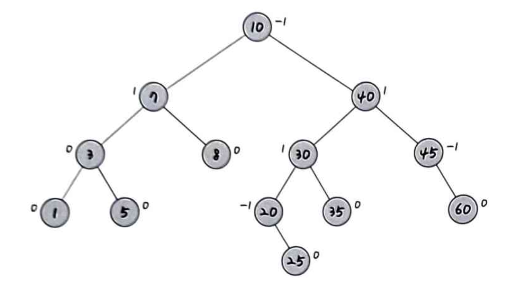
이진 탐색 트리는 선형적인 트리 형태를 가질 때 최악의 경우 O(n)의 시간 복잡도를 가집니다. "이러한 최악의 경우를 배제하고 항상 균형 잡힌 트리로 만들자"라는 개념을 가진 트리가 바로 AVL트리입니다. 탐색, 삽입, 삭제 모두 시간 복잡도가 O(logn)이며 삽입, 삭제를 할 때마다 균형이 안맞는 것을 맞추기 위해 트리 일부를 왼쪽 혹은 오른쪽으로 회전시키며 균형을 잡습니다.

##### 레드 블랙 트리
레드블랙트리는 균형 이진 탐색트리로 탐색, 삽입, 삭제 모두 시간복잡도가 O(logn)입니다. 각 노드는 빨간색 또는 검은색의 색상을 나타내는 추가 비트를 저장하며, 삽입 및 삭제 중에 트리가 균형을 유지하도록 하는데 사용됩니다.

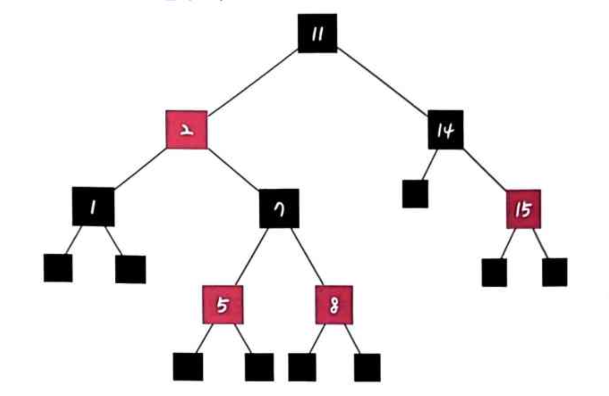
참고로 "모든 리프 노드와 루트노드는 블랙이고 어떤 노드가 레드이면 그 노드의 자식은 반드시 블랙이다." 등의 규칙을 기반으로 균형을 잡는 트리입니다.

#### 힙
힙은 완전 이진트리기반의 자료구조이며, 최소힙과 최대힙 두가지가 있고 해당 힙에 따라 특정한 특징을 지킨 트리를 말합니다.
- 최대 힙: 루트 노드에 있는 키는 모든 자식에 있는 키 중에서 가장 커야 합니다. 또한, 각 노드의 자식 노드와의 관계도 이와같은 특징이 재귀적으로 이루어져야 합니다.
- 최소 힙: 최소힙에서 루트 노드에 있는 키는 모든 자식에 있는 키 중에서 최솟값이어야 합니다. 또한, 각 노드의 자식노드와의 관계도 이와 같은 특징이 재귀적으로 이루어져야 합니다.

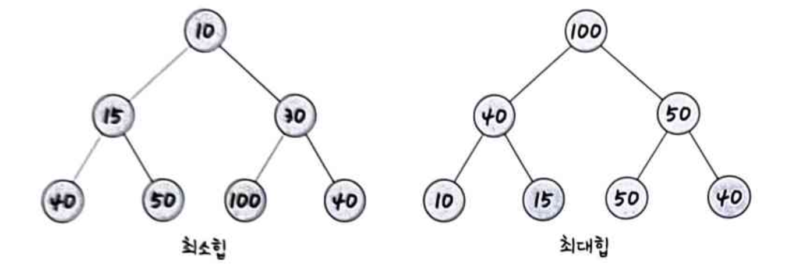
###### 최대힙의 삽입
힙에 새로운 요소가 들어오면, 일단 새로운 노드를 힙의 마지막 노드에 이어서 삽입합니다. 이 새로운 노드를 부모 노드들과의 크기를 비교하며 교환해서 힙의 성질을 만족시킵니다.
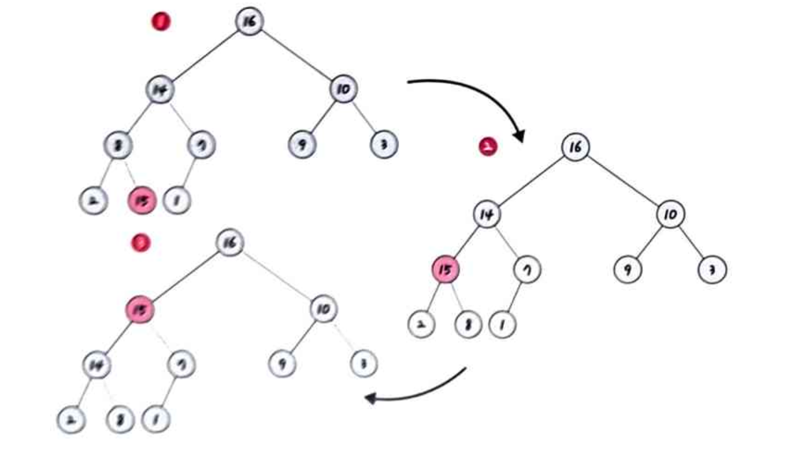
###### 최대합의 삭제
최대힙에서 최댓값은 루트 노드이므로 루트 노드가 삭제되고, 그 이후 마지막 노드와 루트 노드를 스왑하여 또 다시 스왑 등의 과정을 거쳐 재구성됩니다.

#### 우선순위 큐
우선순위 큐는 우선순위 대기열이라고도 하며, 대기열에서 우선순위가 높은 요소가 우선 순위가 낮은 요소보다 먼저 제공되는 자료구조입니다.
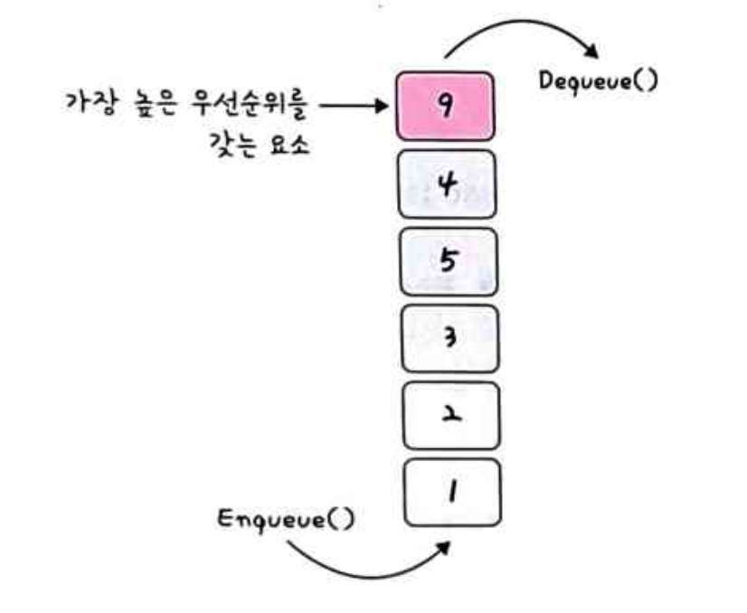
우선순위 큐는 힙을 기반으로 구현됩니다.
#### 맵
맵(Map)은 특정 순서에 따라 키와 매핑된 값의 조합으로 형성된 자료구조입니다. 예를 들어 "이승철":1, "박동영":2 같은 방식으로 string:int 형태로 값을 할당해야할때 Map을 씁니다. 레드블랙트리 자료구조로 형성되고, 삽입하면 자동으로 정렬됩니다.

참고로 Map은 해시테이블을 구현할때 쓰며 정렬을 보장하지않는 unordered_map과 정렬을 보장하는 map 두가지가 있습니다.
#### 셋
셋(Set)은 특정 순서에 따라 고유한 요소를 저장하는 컨테이너이며, 중복되는 요소는 없고 오로지 희소한(unique) 값만 저장하는 자료구조입니다.
#### 해시 테이블
해시테이블은 무한에 가까운 데이터들을 유한한 개수의 해시 값으로 매핑한 테이블입니다. 삽입, 삭제, 탐색 시 평균적으로 O(1)의 시간복잡도를 가지며 unorderd_map으로 구현합니다.

