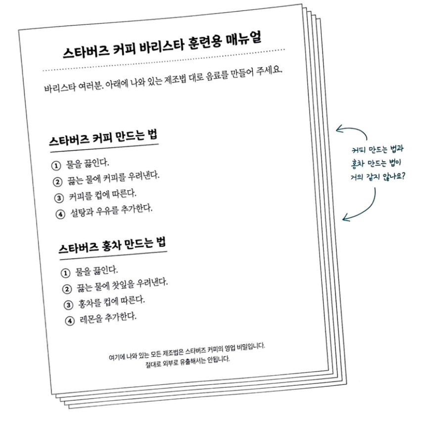
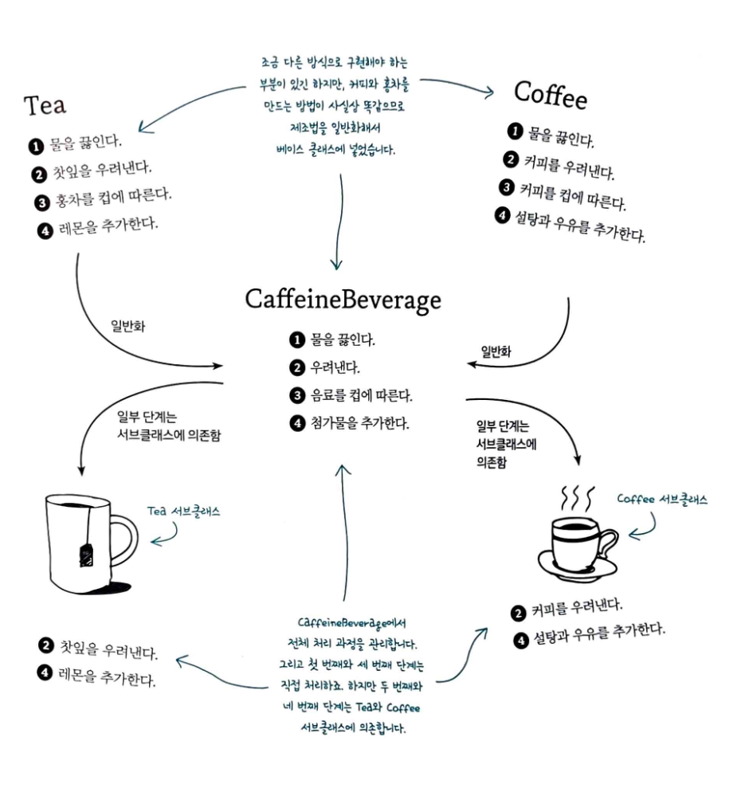
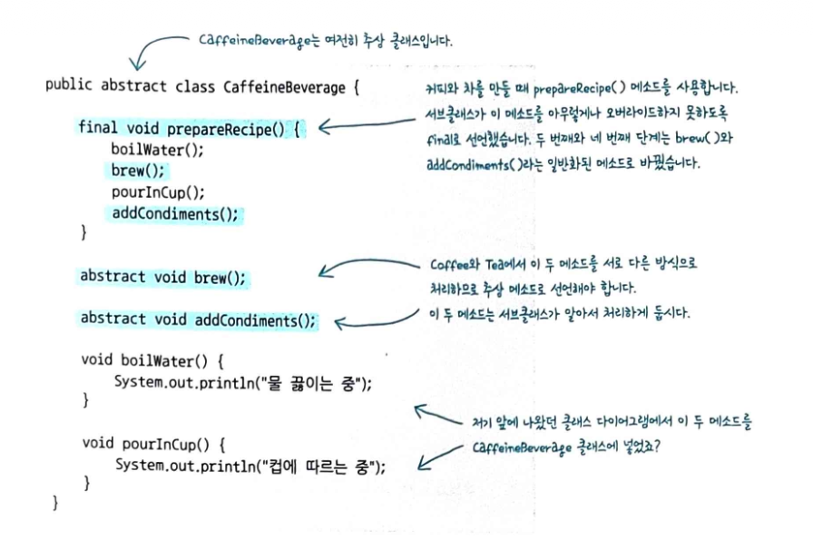
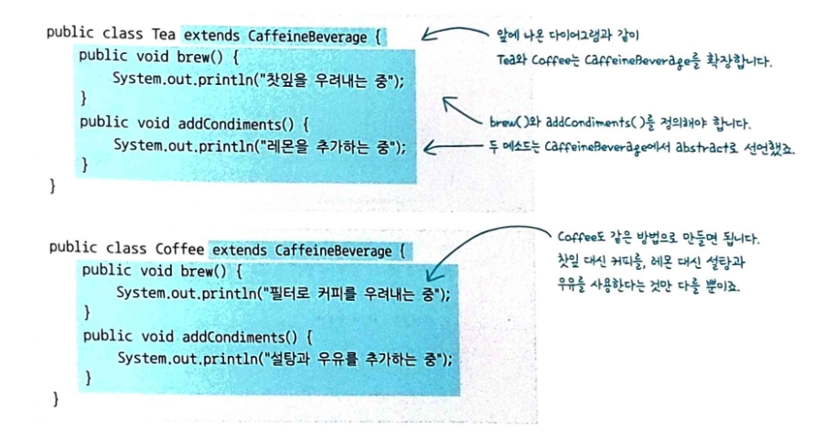

# 템플릿 메소드 패턴
---------
#### 템플릿 메소드 패턴의 정의
- 템플릿 메소드 패턴은 알고리즘의 골격을 정의한다. 템플릿 메소드를 사용하면 알고리즘의 일부 단계를 서브클래스에서 구현할 수 있으며, 알고리즘의 구조는 그대로 유지하면서 알고리즘의 특정 단계를 서브클래스에서 재정의할 수도 있다.
- 템플릿 메소드 패턴 사용 x
  
- 템플릿 메소드 패턴 사용 o
  

#### 템플릿 메소드 패턴의 장점

| 템플릿메소드 사용x                             | 템플릿메소드 사용o                                                   |
| -------------------------------------- | ------------------------------------------------------------ |
| coffee와 Tea 클래스가 각각 작업을 처리한다.          | caffeineBeverage 클래스에서 작업을 처리한다.                             |
| coffee와 Tea 클래스에 중복된 코드가 있다.           | caffeineBeverage 덕분에 서브클래스에서 코드를 재사용할 수 있다.                  |
| 알고리즘이 바뀌면 서브클래스를 일일이 열어서 여러 군데를 고쳐야한다. | 알고리즘이 한 군데에 모여 있으므로 한 부분만 고치면 된다.                            |
| 클래스 구조상 새로운 음료를 추가하려면 꽤 많은 일을 해야한다.    | 다른 음료도 쉽게 추가할 수 있는 프레임워크를 제공한다. 음료를 추가할 때 몇가지 메소드만 더 만들면 된다. |
| 알고리즘 지식과 구현 방법이 여러 클래스에 분산되어 있다.       | caffeineBeverage 클래스에 알고리즘 지식이 집중되어 있으며 일부 구현만 서브클래스에 의존한다.  |

#### 템플릿 메소드 속 후크
- 후크(Hook)는 추상 클래스에서 선언되지만 기본적인 내용만 구현되어 있거나 아무 코드도 들어있지 않은 메소드이다. 이러면 서브클래스는 다양한 위치에서 알고리즘에 끼어들 수 있다. 
- 오버라이드를 하지 않으면 추상 클래스에서 기본으로 제공한 코드가 실행된다.

#### 할리우드 원칙
- 의존성 부패: 고수준 구성 요소가 저수준 구성 요소에 의존하고 그 저수준 구성 요소가 다시 고수준 구성 요소에 의존하는 상황을 의존성이 부패했다고 표현한다. 
- 할리우드 원칙은 의존성부패를 방지하기 위해 고수준 구성요소가 저수준 구성요소를 언제 사용할지 결정하는 방식
- 템플릿 메소드 패턴에선 추상클래스가 고수준 구성 요소이다. 저수준 구성 요소인 알고리즘을 장악하고 있고, 메소드 구현이 필요한 상황에만 서브클래스를 불러낸다.

#### 전략패턴과 템플릿 메소드패턴의 차이
- 전략 패턴
	- 일련의 알고리즘을 정의하고 그 알고리즘들을 서로 바꿔가면서 쓸 수 있게 한다. 각 알고리즘은 캡슐화되어 있어 클라이언트에서 손쉽게 서로 다른 알고리즘을 사용할 수 있다.
- 템플릿 메소드 패턴
	- 알고리즘의 개요를 정의하고 서브클래스에서 정의된 클래스를 상속받아 작업의 일부를 구현한다. 이러면 각 단계마다 다른 구현을 사용하면서도 알고르짐 구조 자체는 그대로 유지할 수 있다.

#### 핵심정리
- 템플릿 메소드는 알고리즘의 단계를 정의하며 일부 단계를 서브클래스에서 구현하도록 할 수 있다.
- 템플릿 메소드 패턴은 코드 재사용에 큰 도움이 된다.
- 템플릿 메소드가 들어있는 추상클래스는 구상 메소드, 추상 메소드, 후크를 정의할 수 있다.
- 추상 메소드는 서브클래스에서 구현한다.
- 후크는 추상 클래스에 들어있는 메소드로 아무 일도 하지 않거나 기본 행동만을 정의한다. 서브 클래스에서 후크를 오버라이드할 수 있다.
- 할리우드 원칙에 의하면, 저수준 모듈을 언제 어떻게 호출할지는 고수준 모듈에서 결정하는 것이 좋다고 한다.
- 템플릿 메소드 패턴은 실전에서도 꽤 자주 쓰이지만 반드시 '교과서적인' 방식으로 적용되진 않는다.
- 전략 패턴과 템플릿 메소드 패턴은 모두 알고리즘을 캡슐화하는 패턴이지만 전략 패턴은 구성을, 템플릿 메소드 패턴은 상속을 사용한다.
- 팩토리 메소드 패턴은 특화된 템플릿 메소드 패턴이다.

#### 구현

