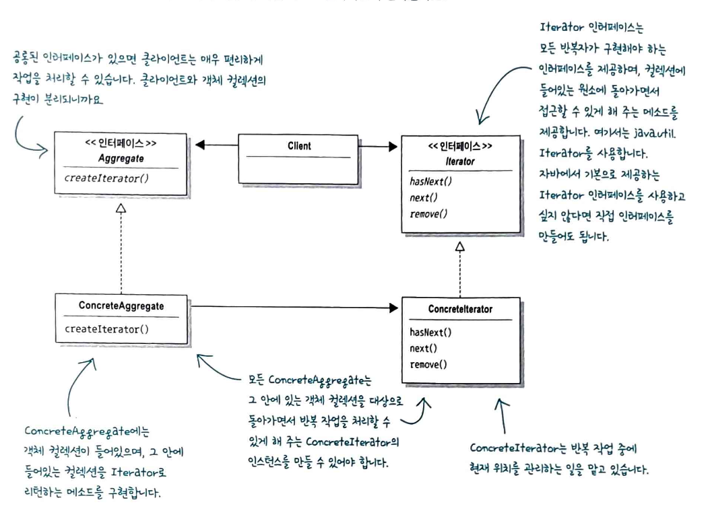

# 반복자 패턴과 컴포지트 패턴
--------

#### 반복을 캡슐화하기
- 바뀌는 부분은 캡슐화 하라
```
// 반복문
for (int i = 0; i < breakfastItems.size(); i++) {
  MenuItem menuItem = breakfastItems.get(i);
}

// 반북문 -> Iterator 캡슐화
Iteraor iterator = breakfastMenu.createIterator();

While (iterator.hasNext()) {
	MenuItem menuItem = iterator.next();
}
```

#### 반복자 패턴 알아보기
- 반복 작업을 캡슐화하는 것을 일종의 디자인패턴으로 반복자(Iterator) 패턴이라고 한다.
- 반복자 패턴은 Iterator 인터페이스 에 의존한다.
- interface Iterator {
	  hasNext()       // 반복작업을 적용할 대상이 있는지 확인
	  next()              // 다음 객체를 리턴
  }
	


#### 반복자 패턴의 특징 알아보기

--------

| 반복문                            | Iterator          |
| :----------------------------- | :---------------- |
| 메뉴 캡슐화 X                       | 메뉴 캡슐화 O          |
| 반복 작업을 하려면 2개의 순환문 필요          | 어떤 컬렉션 이든 1개의 순환문 |
| []과 List 에 직접 연결               | 인터페이스만 알면 됌       |
| 유사한 인터페이스를 가졌음에도 서로 다른 클래스에 묶임 | 인터페이스 통일          |


#### 반복자 패턴의 정의
- 반복자 패턴(Iterator Pattern)은 컬렉션의 구현 방법을 노출하지 않으면서 집합체 내의 모든 항목에 접근하는 방법
- 컬렉션 객체 안에 들어있는 모든 항목에 접근하는 방식이 통일되어 있으면 종류에 관계없이 모든 집합체에 사용할 수 있는 다형적인 코드를 만들 수 있다.
- 반복자 패턴을 사용하면 모든 항목에 일일이 접근하는 작업을 컬렉션 객체가 아닌 반복자 객체가 맡게 된다.

#### 반복자 패턴의 구조 알아보기


#### 단일 역할 원칙
- 배경: 클래스에서 원래 그 클래스의 역할(집합체 관리) 외에 다른 역할(반복자 메소드)을 처리할 때 2가지 이유로 그 클래스가 바뀔 수 있다
- 컬렉션이 어떤 이유로 바뀌게 되면 그 클래스도 바뀌어야 한다.
- 반복자 관련 기능이 바뀌었을 때도 클래스가 바뀌어야 한다.

- 디자인원칙
	- 어떤 클래스가 바뀌는 이유는 하나뿐이어야한다.
	- 클래스를 고치는 일은 최대한 피해라
	- 하나의 역할은 하나의 클래스에서만 맡아야한다.
- 응집도
	- 한 클래스 또는 모듈이 특정 목적이나 역할을 얼마나 일관되게 지원하는지를 나타내는 척도이다.
	- 어떤 모듈이나 클래스의 응집도가 높다는 것은 서로 연관된 기능이 묶여있다는 것을, 응집도가 낮다는 것은 서로 상관 없는 기능들이 묶여있다는 것을 뜻합니다.
	- 사실 응집도는 단일 역할 원칙에서만 쓰이는 용어는 아니고, 좀 더 광범위한 용도로 쓰이는 용어입니다. 하지만 단일 역할 원칙과 응집도는 서로 밀접하게 연관되어 있습니다. 이 원칙을 잘 따르는 클래스는 2개 이상의 역할을 맡고 있는 클래스에 비해 응집도가 높고, 관리하기도 쉽습니다.


#### 향상된 for 순환문 알아보기
List 는 Iterater 대신 향상된 for 문을 사용할 수 있다.
배열은 Iterable 인터페이스가 아니라서 대신 forEach 순환문을 사용한다.
HashMap 은 반복자를 가져올 수 있지만 values컬렉션을 먼저 가져온 후 반복자를 받아와야 한다.


#### 컴포지트 패턴의 정의
- 컴포지트 패턴(Composite Pattern)으로 객체를 트리구조로 구성해서 부분-전체 계층구조를 구현합니다. 컴포지트 패턴을 사용하면 클라이언트에서 개별 객체와 복합 객체를 똑같은 방법으로 다룰 수 있습니다.
- 컴포지트 패턴을 사용하면 객체의 구성과 개별 객체를 노드로 가지는 트리 형태의 객체 구조를 만들 수 있습니다.
- 이런 복합구조(Composite Structure)를 사용하면 복합 객체와 개별 객체를 대상으로 똑같은 작업을 적용할 수 있습니다. 즉, 복합객체와 개별객체를 구분할 필요가 거의 없어진다.


